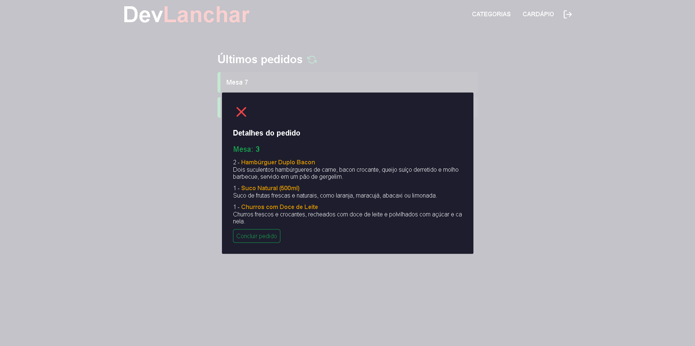

# DevLanchar

## Exemplo de Software para Lanchonete

O DevLanchar é um software desenvolvido para lanchonetes que possibilita visualizar os últimos pedidos feitos através do aplicativo de celular. Além disso, oferece funcionalidades para cadastrar novos produtos e categorias, proporcionando uma experiência mais moderna e eficiente para a equipe.

- [Link do Projeto](https://front-end-dev-lanchar.vercel.app)

## Imagens

## Funcionalidades

- Visualização dos últimos pedidos realizados através do aplicativo de celular.
- Cadastro de novos produtos no cardápio com informações detalhadas, como nome, descrição e preço.
- Criação e gerenciamento de categorias de produtos para melhor organização do cardápio.

## Tecnologias Utilizadas

- [Next.js](https://nextjs.org/): Um framework React para desenvolvimento web.
- [TypeScript](https://www.typescriptlang.org/): Uma linguagem de programação que adiciona tipagem estática ao JavaScript.
- [Tailwind CSS](https://tailwindcss.com/): Uma estrutura CSS utilitária para construir interfaces personalizadas rapidamente.
- [Axios](https://axios-http.com/): Biblioteca para fazer requisições HTTP.

O DevLanchar possui um **sistema backend próprio** desenvolvido utilizando tecnologias como Node.js e um banco de dados PostgreSQL. O sistema backend é responsável por lidar com as requisições vindas do aplicativo de celular e do frontend da aplicação, processando as informações, realizando ações como criar conta, fazer login, cadastrar novos produtos e categorias, e fornecendo os dados necessários para a exibição dos últimos pedidos.

A escolha de um sistema backend próprio proporciona maior flexibilidade e controle sobre o desenvolvimento e manutenção da aplicação. Além disso, possibilita a integração com outros sistemas e serviços específicos da lanchonete, tornando o DevLanchar uma solução personalizada e adequada às necessidades do estabelecimento.